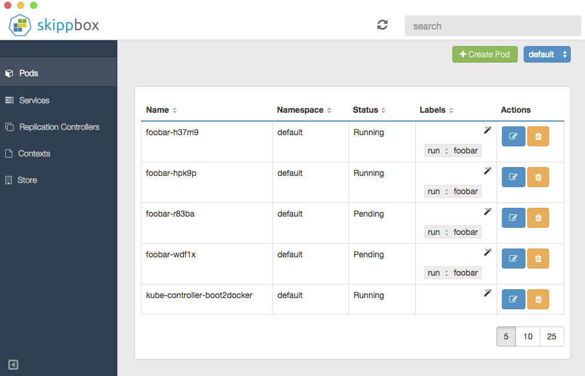

Desktop Application for Kubernetes
==================================

_skippbox_ is a Desktop application to manage applications deployed on [Kubernetes](http://kubernetes.io).
It supports multiple k8s endpoints and accesses a public application [_store_](https://github.com/skippbox/appstore).

*This is still a work in progress, expect frequent changes*

By default it will connect with a k8s API server running at `http://localhost:8080/api`

Requirements
------------

You will need a Kubernetes endpoint configured in your `kubectl` configuration file.

If you are not familiar with Kubernetes yet, you can use `boot2k8s` to get a one node Kubernetes cluster running locally.
Go to the [boot2k8s](https://github.com/skippbox/boot2k8s) page and set it up.

Run in development
------------------

`kui` is a [NW.js](http://nwjs.io) application similar to Docker [Kitematic](https://kitematic.com) but aimed at Kubernetes operations.

Install [nwjs](https://github.com/nwjs/nw.js)

    $ npm install nw

Clone the repository and install the application:

    $ git clone https://github.com/skippbox/kui.git
    $ cd kui
    $ npm install

Then start the UI with:

    $ npm start

Snapshot
--------

Here is a preview of what it looks like

